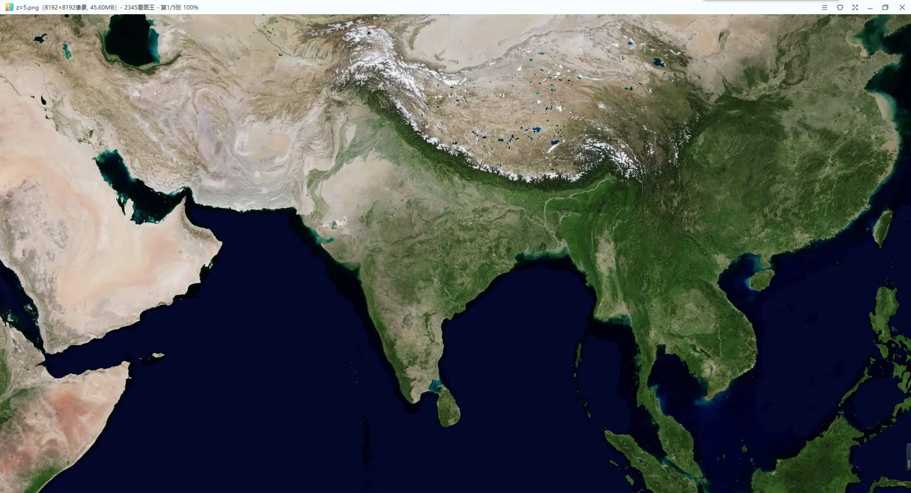
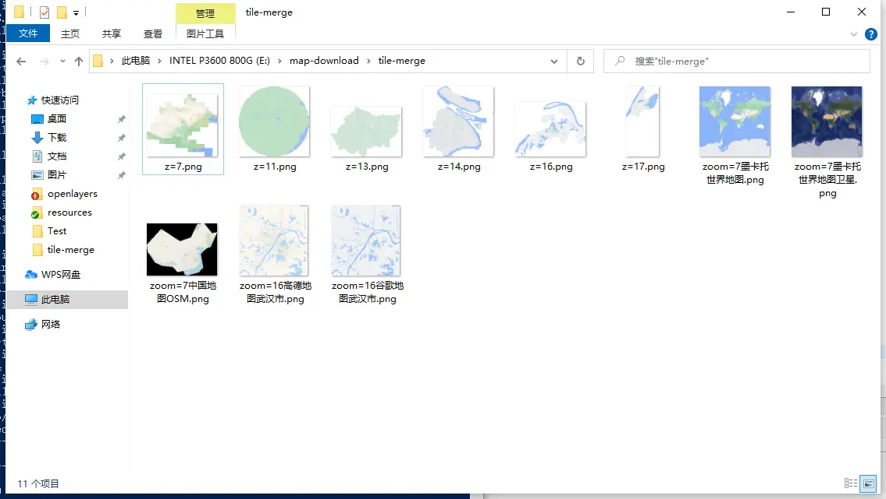
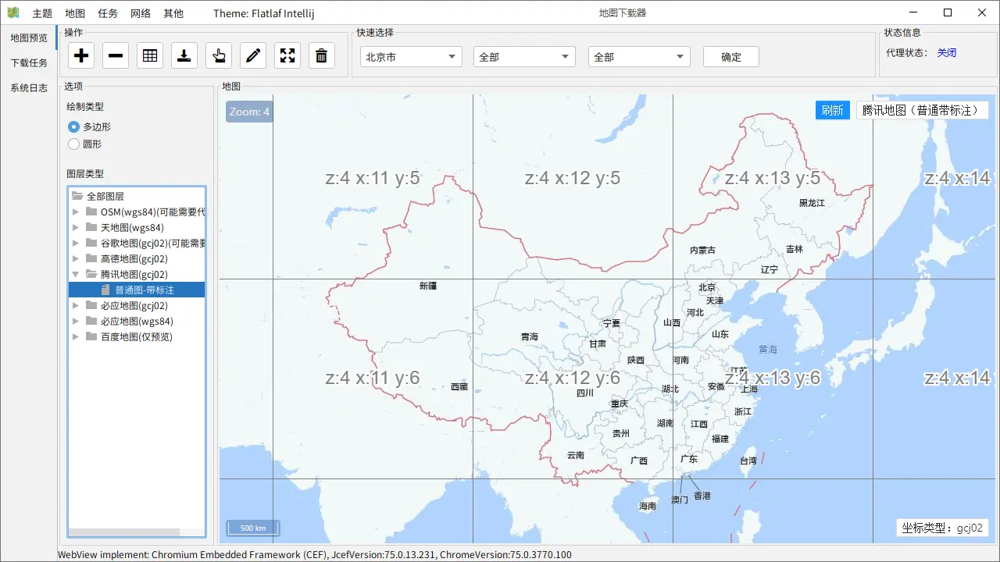
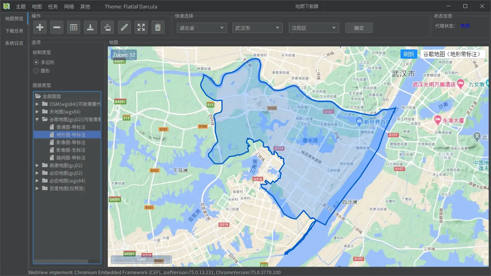
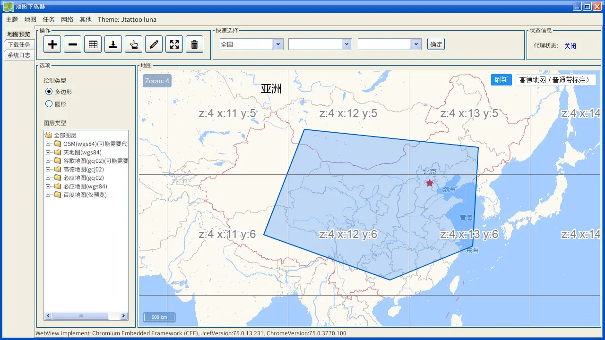
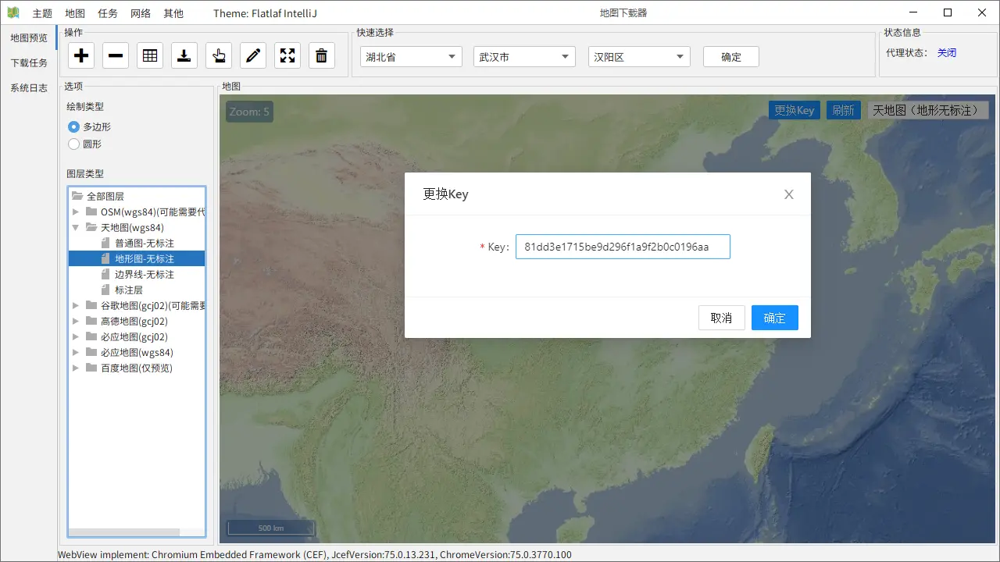
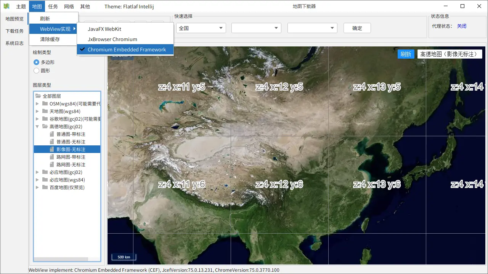

# 地图瓦片图下载器

#### 本处为备份仓库，码云为主仓库
#### 码云仓库地址：https://gitee.com/CrimsonHu/java_map_downlnload

#### 使用JetBrains Runtime 17，SpringBoot 3.0，JCEF版本为Chromium 104

#### 介绍
使用Java开发的地图瓦片图下载工具，支持以下XYZ瓦片图下载与合并。多线程瓦片图下载，最大限度地使用本机网络资源。
- OpenStreetMap
- 谷歌地图（需要代理）
- 天地图（务必更换自己的key，并注意配额）
- 高德地图
- 腾讯地图
- 必应地图

#### 声明
- 本项目使用GPL 2.0协议开源，任何基于本项目的二次开发需遵守相关开源协议。
- 本项目仅为个人兴趣开发，不收费，作者也不提供任何付费服务。
- 本项目仅供个人学习研究使用。
- 本项目禁止商用，禁止在企业项目开发中使用此下载器下载地图，禁止使用此项目以及基于此项目二次开发的软件从事盈利活动。
- Build程序仅供方便预览本项目的各项功能，不作为最终运行本体。

#### 注意
该程序会挂在系统托盘，退出程序请在托盘中右键程序图标退出

#### 集思广益
各位若有瓦片图纠偏的思路欢迎留言讨论

#### Build下载地址（已打包的可执行程序，解压即可运行）
- 更新日期：2023-04-09（下载最新版注意该更新时间）
- 重要提示：下载谷歌地图需正确使用代理，不能下载就是代理没设置好
- 若无法打开，请将文件夹改为英文，并注意文件夹所在详细路径是否为全英文
- 使用多网盘发布，防止链接失效
- 百度网盘：https://pan.baidu.com/s/1CA7sdH6zL4OjJxVydKwrWQ  密码：mdve 
- 天翼云盘：https://cloud.189.cn/t/IBFrIzIFZz6j 密码:5bgb
- 联通云盘：https://pan.wo.cn/s/1W1t0v642 密码:eZB0

#### 版本预览
以下功能在下次更新中加入：
- 添加桌面悬浮窗，用于显示下载进度
- 在长时间重试错误瓦片无效后，添加一个对话框，询问是否继续下载，是否合并瓦片。如遇到这个问题，点击暂停任务，过十几分钟再下载，就不会一直出错了。[相关issue](https://gitee.com/CrimsonHu/java_map_download/issues/I6NH24)

#### 更新历史
- 2023-04-09：优化大量代码，添加[自定义图层功能](https://gitee.com/CrimsonHu/java_map_download/issues/I6KPWN)，添加webp支持，优化拼接大图导出格式
- 2022-11-26：JRE换为JetBrains Runtime 17，更新至SpringBoot 3.0.0，删除JxBrowser与JavaFX WebView，优化大量代码，更新谷歌地图域名
- 2022-03-25：更新至Java17 LTS，SpringBoot 2.6.4，JCEF更新至Chromium95内核；优化代码
- 2021-04-09：优化依赖结构，减少打包体积（注意：不要进行无意义的超巨大尺寸合并，那样OpenCV会内存溢出）
- 2021-03-24：添加腾讯地图地图，添加坐标类型显示，修复部分问题
- 2021-03-22：添加天地图key更换功能、添加必应地图，添加并更换默认WebView为Chromium Embedded Framework（JCEF）
- 2021-03-01：优化界面显示，修复部分问题
- 2021-02-18：默认地图设为高德地图；添加http代理支持，用于下载谷歌地图
- 2020-11-28：优化错误瓦片图自动重新下载功能
- 2020-11-27：初步添加错误瓦片图自动重新下载功能，解决无法下载天地图的问题

#### JetBrains Runtime下载地址
- https://github.com/JetBrains/JetBrainsRuntime/tree/jbr17
- 在Binaries for developers这一栏中下载“JBR with JCEF”，文件名以“jbrsdk_jcef”开头的

#### 代码运行说明
1. 开发环境：JetBrains Runtime 17，Angular 15
2. IDE需要安装lombok插件
3. 解压lib目录下的opencv(原版备份).jar文件，Windows系统下将opencv.dll放入至jdk/bin目录，macOS系统下将libopencv.dylib放入至jdk/Contents/Home/lib目录
4. 在SpringBoot项目中，解压db.7z，将db.sqlite3放入至resource目录下
5. 编译Angular项目，将dist目录下的web文件夹放入SpringBoot项目的resource目录下

#### 软件说明
1. 使用SpringBoot+Swing+Angular开发的桌面程序
2. 内置若干Swing主题皮肤
3. Webview使用JetBrains Runtime自带的Chromium Embedded Framework
4. 支持Windows与macOS
5. 支持png与jpg格式存储瓦片图，并支持瓦片图合并
6. 多线程瓦片图下载，最大限度地使用网络资源，拒绝付费限速
7. 瓦片图下载使用okhttp3实现
8. 使用OpenCV进行瓦片图合并，支持大尺寸png合成图
9. 下述图片为各历史版本图片，新版与旧版整体上大致相同，不影响主要功能介绍

#### 主要功能
XYZ瓦片图下载与拼接

#### 主要界面

#### 使用代理访问并下载谷歌地图（2021-02-18版本）
.jpg")
%[XYM.png")

#### 以下为旧版截图

0TH_XO2)LL.png")

##### macOS(Intel)下截图

